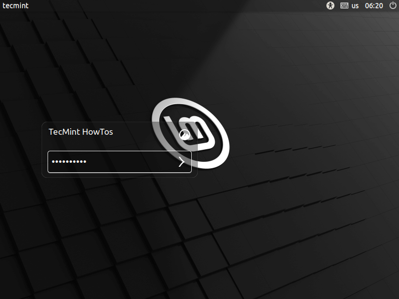
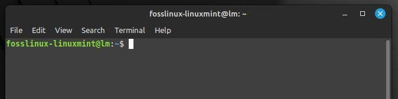

Documentation
=============

How do I start using this lab?
------------------------------
Welcome! this section will guide you on basic initial setup to start a new project using our computational environment.

1) To start using the computational environment, you need an ``username`` and ``password``. If required please contact Peter Auriger to get one.
2) When you have lab credentials, you are assigned to a machine. To see the location of those machines, please go :ref:`here<Computational_Infraestructure_Tab>`.
3) Star a new session using your credentials:

4) It will open your session on a Linux Mint distribution, which looks like this:

.. image::
   Images/cinnamon.png
   :width: 600

The menu is in the down-left corner, it is the place where you access for all applications. You can type in the search bar ``firefox`` or ``terminal`` to access to the :abbr:`Terminal(Command-line in Linux)`.

5) Open a ``terminal`` window, you will see a window with a command promtp that lools like this:

The prompt shows the ``username`` of the current user, followed by the computer’s hostname, and then the current working directory. Finally, the ``$`` symbol indicates that the terminal is ready to accept commands. The terminal interface consists of a command line and a shell. The command line is where you type your commands, while the shell is the program that interprets and executes those commands.

.. https://www.fosslinux.com/103546/the-beginners-guide-to-using-terminal-on-linux-mint.htm

6) Go to your :abbr:`scratch folder (Folder where you will store your data, located in the assigned machine)`, typing:

   .. code-block:: bash

      $ cd /srv/<machine_name>/<your_username>/

Please refer to :ref:`this section <using_scratch>` for more details about your **scratch** folder.

7) You can start creating a project using :ref:`this <create_project>`.
8) Once you have a project, it makes sense to create its corresponding ``conda`` environment. This will serve to install programs and isolate them from the system. Please refer to :ref:`this section<using_conda>`.
9) Create a new code using Visual Studio Code (``VSCode``). With this program you are able to write, read, or/and modify text files. At the same time, using extensions, it is able to run ``python`` or ``R`` code, as follows:

    .. code-block:: console
    
        $ cd <your project folder> # Access to the project folder
        $ code . # Open VSCode in the Project folder

``VScode`` looks like this:

.. image::
   Images/vscode.png
   :width: 600

10) Please follow this `small tutorial <https://code.visualstudio.com/docs/getstarted/getting-started>`_ to learn how to interact with ``VSCode``. 

Credentials and access
----------------------

How to change my user password?
^^^^^^^^^^^^^^^^^^^^^^^^^^^^^^^

Open a terminal and type the command ``passwd``, and follow the instructions. When prompted to enter your current and new password, no characters will appear on the screen while you type (this is normal). Simply type your password and press Enter each time.

  .. code-block:: console

     $ passwd
     Changing password for username.
     Current password:

.. _using_scratch:
   
User's scratch folder
---------------------

How do I access my scratch folder?
^^^^^^^^^^^^^^^^^^^^^^^^^^^^^^^^^^

Your **scratch** folder is named the same as your username and is located at:

``/srv/<machine_name>/<your_username>/``

To access it, follow these steps:

1. **Use the `cd` command** to navigate to your scratch directory. Replace `<machine_name>` with the machine's name and `<your_username>` with your username:

   .. code-block:: bash

      $ cd /srv/<machine_name>/<your_username>/

2. If you encounter a ``No such file or directory`` error, double-check that you have entered the correct machine name and username. If the folder does not exist, you are likely in the wrong location.  

.. _create_project:

How do I create a project folder in my scratch folder?
^^^^^^^^^^^^^^^^^^^^^^^^^^^^^^^^^^^^^^^^^^^^^^^^^^^^^^

To create a project folder inside your **scratch** directory, follow these steps:

1. **Navigate to your scratch folder** using the `cd` command:

   .. code-block:: bash

      $ cd /srv/<machine_name>/<your_username>/

2. **Create a new folder** using the `mkdir` command. Replace `<folder_name>` with your desired folder name:

   .. code-block:: bash

      $ mkdir <folder_name>
      $ cd <folder_name>
      $ mkdir code
      $ mkdir data
      $ mkdir results

or a one-liner:

    .. code-block:: bash

        $ mkdir -p <folder_name>/{code,data,results} && cd <folder_name>

3. To **verify that the folder was created**, list the contents of the directory:

   .. code-block:: bash

      $ ls -l

or to see the complete structure, like this:

    .. code-block:: bash

        $ tree <folder_name>
        <folder_name>
        ├── code
        ├── data
        └── results

If you see your new folder in the output or the folder structure as a tree, the project' folder was successfully created.

How do I connect remotely to my scratch using an Unix machine:
^^^^^^^^^^^^^^^^^^^^^^^^^^^^^^^^^^^^^^^^^^^^^^^^^^^^^^^^^^^^^^

 Use the Cisco platform using your MEDUni credentials to use a valid ``VPN`` connection. Once you are connected, type:

   .. code-block:: bash

      $ ssh <user_name>@<ip address>

The ``IP`` address for each machine is specified in this :ref:`table<Computational_Infraestructure_Tab>`.

.. _using_conda:

Conda environment management
----------------------------

This section provides answers to common questions about managing **conda** environments, including creating, deleting, installing packages, and locating environments.

.. _create-delete-conda-env:

How do I create and delete a conda environment?
^^^^^^^^^^^^^^^^^^^^^^^^^^^^^^^^^^^^^^^^^^^^^^^^^^

**To create a conda environment:**

1. Use the following command, replacing `<env_name>` with your desired environment name and `<python_version>` with the required Python version:

   .. code-block:: bash

      $ conda create --name <env_name> python=<python_version>

   Example:

   .. code-block:: bash

      $ conda create --name myenv python=3.9

2. Activate the environment:

   .. code-block:: bash

      $ conda activate <env_name>

---

**To delete a conda environment:**

1. Deactivate the environment if it’s active:

   .. code-block:: bash

      $ conda deactivate

2. Use the following command to delete the environment:

   .. code-block:: bash

      $ conda env remove --name <env_name>

---

.. _install-uninstall-conda-packages:

How do I install and uninstall packages in a conda environment?
^^^^^^^^^^^^^^^^^^^^^^^^^^^^^^^^^^^^^^^^^^^^^^^^^^^^^^^^^^^^^^^^^^^

**To install a package:**

1. Activate the environment:

   .. code-block:: bash

      $ conda activate <env_name>

2. Install the desired package (replace `<package_name>` with the package name):

   .. code-block:: bash

      $ conda install <package_name>

   Example:

   .. code-block:: bash

      $ conda install samtools

---

**To uninstall a package:**

1. Ensure the environment is activated:

   .. code-block:: bash

      $ conda activate <env_name>

2. Uninstall the package:

   .. code-block:: bash

      $ conda remove <package_name>

   Example:

   .. code-block:: bash

      $ conda remove samtools
 
---

.. _list-conda-envs:

How do I list my conda environments?
^^^^^^^^^^^^^^^^^^^^^^^^^^^^^^^^^^^^^^^

To list all available conda environments, use the following command:

.. code-block:: bash

   $ conda env list

Or:

.. code-block:: bash

   $ conda info --envs

The output will show the names of the environments along with their paths, with the currently active environment marked by an asterisk (*).

---

How do I clone a conda environment and create one from a file?
^^^^^^^^^^^^^^^^^^^^^^^^^^^^^^^^^^^^^^^^^^^^^^^^^^^^^^^^^^^^^^

--
**Clone an environment**

To create an exact copy of an existing conda environment, use the `conda create` command with the `--clone` option:

1. Use the following command, replacing `<existing_env>` with the name of the environment to clone and `<new_env>` with the name of the new environment:

   .. code-block:: bash

      $ conda create --name <new_env> --clone <existing_env>

Example:

.. code-block:: bash

   $ conda create --name myenv_clone --clone myenv

---

**Create a conda environment file**

You can create a conda environment from an **environment file** (typically `environment.yml`) that lists all dependencies and configurations.

1. Ensure you have the `environment.yml` file.
2. Run the following command:

   .. code-block:: bash

      $ conda env create --file environment.yml

This will create the environment with the name specified in the `name:` field of the `environment.yml` file.

---

**Create a conda environment file from existing environment**

To generate an `environment.yml` file from an existing environment (useful for sharing or recreating the environment elsewhere), use:

.. code-block:: bash

   $ conda activate <env_name>
   $ conda env export > environment.yml

This command will save the current environment's configuration to `environment.yml`.

---

**Update a conda environment**

If you need to update an existing environment using an updated `environment.yml` file:

.. code-block:: bash

   $ conda env update --file environment.yml --prune

The `--prune` option removes dependencies no longer required from the environment.
   
.. _locate-conda-env-path:

How do I locate the path of a specific conda environment?
^^^^^^^^^^^^^^^^^^^^^^^^^^^^^^^^^^^^^^^^^^^^^^^^^^^^^^^^^^^^

To find the path of a particular conda environment, use the following command:

.. code-block:: bash

   $ conda env list

This will display all environments with their corresponding paths.

Alternatively, if the environment is active, you can use:

.. code-block:: bash

   echo $CONDA_PREFIX

This will return the full path to the active environment.

FAQs
----

.. _where-is-external-device-mounted:

Where is my external device mounted?
------------------------------------

Your external devices (such as memory sticks or hard disks) are mounted in the following directory:

``/run/media/<your_username>/``

To locate your device:

1. **Navigate to the mount directory** using the `cd` command:

   .. code-block:: bash

      cd /run/media/<your_username>/

2. **List the contents** to see the names of the mounted devices:

   .. code-block:: bash

      ls -l

You will recognize your device by its name in the list. If you don’t see your device, ensure it is properly connected and mounted.
